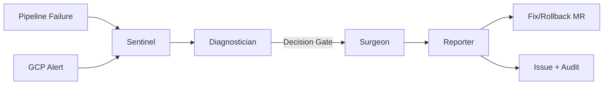

# SentryFlow

**A Self-Healing DevOps Agent Flow for GitLab**

> From failure to fix in seconds — not hours.
---

## Overview

SentryFlow is a unified self-healing DevOps agent flow built on the **GitLab Duo Agent Platform**. It combines two critical failure-response systems into a single four-agent flow:

- **Pipeline Self-Healing** — When a CI/CD pipeline fails, the agent automatically reads job logs, diagnoses the root cause, and opens a merge request with the fix.
- **Production Incident Response** — When a GCP Cloud Monitoring alert fires, the agent correlates the incident with recent deployments, identifies the suspect commit, and drafts a rollback MR.

Both failure modes flow through the same four-agent architecture:

```
Sentinel → Diagnostician → Surgeon → Reporter
```

---

## Architecture

### Four-Agent Design

| Agent | Role | Description |
|---|---|---|
| **Sentinel** | Event Ingestion & Routing | Listens for GitLab pipeline failure events and GCP Cloud Monitoring alerts via Pub/Sub. Normalizes both into a unified incident schema and routes to the Diagnostician. |
| **Diagnostician** | Root Cause Analysis | For pipeline failures: parses job logs and identifies failure category (test, dependency, config, infra). For production incidents: correlates incident timestamp with recent deployments and commits, pulls GCP Cloud Logging context. |
| **Surgeon** | Fix Generation & Action | Based on diagnosis, takes action: code/config fix MR, rollback MR, or issue-only for low-confidence cases. |
| **Reporter** | Communication & Audit | Posts structured incident summary to MR/issue with root cause, affected services, fix applied, confidence level, and GCP log links. Logs event to BigQuery for historical analysis. |

### Flow Diagram



### Dual-Trigger Architecture

**Trigger A — Pipeline Failure:**
```
GitLab pipeline event (failed) → Sentinel (extracts job ID, reads logs)
  → Diagnostician (categorizes failure) → Surgeon (generates fix)
  → opens MR on new branch → Reporter posts diagnosis
```

**Trigger B — Production Incident:**
```
GCP Cloud Monitoring alert → Pub/Sub → GitLab issue (mentions agent)
  → Sentinel (normalizes alert payload) → Diagnostician (correlates with recent deploys)
  → identifies suspect commit → Surgeon (drafts rollback MR)
  → Reporter posts summary with GCP log links
```

---

## Google Cloud Integration

| GCP Service | Priority | Role |
|---|---|---|
| **Cloud Monitoring** | Core | Production incident trigger. Alert policies detect error rate spikes, latency anomalies, or resource exhaustion. |
| **Cloud Pub/Sub** | Core | Event routing layer. Bridges GCP alerts to the GitLab agent flow. |
| **Cloud Logging** | Core | Infrastructure context for diagnosis. Correlates pipeline/production failures with infrastructure events. |
| **BigQuery** | Enhancement | Audit trail and trend analysis. Logs every incident with trigger type, root cause, fix applied, and resolution time. |

---

## Platform Tools Used

| Tool | Used By | Purpose |
|---|---|---|
| `get_job_logs` | Sentinel, Diagnostician | Read failed pipeline job output |
| `get_pipeline_errors` | Sentinel, Diagnostician | Get logs for failed jobs from latest pipeline |
| `get_pipeline_failing_jobs` | Sentinel | Identify which jobs failed |
| `list_commits` | Diagnostician | Find recent commits for deployment correlation |
| `get_commit` / `get_commit_diff` | Diagnostician | Analyze suspect commit changes |
| `get_repository_file` | Diagnostician, Surgeon | Read config files and source code |
| `gitlab_blob_search` / `grep` | Diagnostician | Search codebase for relevant context |
| `find_files` / `list_repository_tree` | Surgeon | Understand project structure for fix generation |
| `create_file_with_contents` / `edit_file` | Surgeon | Create or modify files for the fix |
| `create_commit` | Surgeon | Commit fix/rollback to a new branch |
| `create_merge_request` | Surgeon | Open MR with fix or rollback |
| `create_merge_request_note` | Reporter | Post diagnosis summary to MR |
| `create_issue` / `create_issue_note` | Surgeon, Reporter | Create and annotate incident issues |
| `run_command` | Sentinel, Diagnostician, Reporter | Execute gcloud/bq CLI for GCP integration |

---

## Repository Structure

```
sentryflow/
├── README.md                           # This file
├── LICENSE                             # MIT License
├── AGENTS.md                           # Agent customization context
├── agents/
│   ├── sentinel.yml                    # Sentinel agent definition
│   ├── diagnostician.yml               # Diagnostician agent definition
│   ├── surgeon.yml                     # Surgeon agent definition
│   ├── reporter.yml                    # Reporter agent definition
│   └── agent.yml.template              # Hackathon template (reference)
├── flows/
│   ├── sentryflow.yml                  # SentryFlow custom flow (4-agent pipeline)
│   └── flow.yml.template               # Flow template (reference)
├── skills/
│   ├── pipeline-diagnosis/
│   │   └── SKILL.md                    # Pipeline failure diagnosis skill
│   ├── incident-correlation/
│   │   └── SKILL.md                    # Deployment-incident correlation skill
│   └── gcp-integration/
│       └── SKILL.md                    # GCP API interaction patterns
├── docs/
│   ├── architecture.md                 # Detailed architecture doc
│   └── gcp-setup.md                    # GCP project setup guide
└── examples/
    ├── sample-pipeline-failure/        # Test fixtures for pipeline failures
    │   ├── broken-test.yml             # Deliberately broken CI config
    │   ├── incident-schema.json        # Sample Sentinel output
    │   ├── diagnosis-test-failure.json # Sample Diagnostician output
    │   ├── diagnosis-dependency-issue.json
    │   └── diagnosis-config-error.json
    └── sample-gcp-alert/              # Sample Cloud Monitoring alert payloads
        ├── alert-payload.json          # GCP alert JSON
        ├── pubsub-message.json         # Pub/Sub message wrapper
        └── cloud-function/             # GCP → GitLab bridge function
            ├── main.py
            ├── requirements.txt
            └── deploy.sh
```

---

## Setup

### Prerequisites

- GitLab project in the AI Hackathon group with agent platform access
- A GCP project with Cloud Monitoring, Logging, Pub/Sub, and BigQuery APIs enabled

### Quick Start

1. Clone this repository
2. Register the agents in your GitLab project (Automate > Agents)
3. Configure GCP project (see [docs/gcp-setup.md](docs/gcp-setup.md))
4. Push a broken commit to trigger the pipeline self-healing flow

### GCP Setup

See [docs/gcp-setup.md](docs/gcp-setup.md) for detailed instructions on:
- Enabling required APIs
- Creating Pub/Sub topics and subscriptions
- Configuring Cloud Monitoring alert policies
- Setting up BigQuery audit trail
- Service account and IAM configuration

---

## How It Works

### Pipeline Failure (Demo)

1. A commit breaks a test — the pipeline fails.
2. Sentinel detects the failure and normalizes it into the unified incident schema.
3. Diagnostician reads the job logs and categorizes the failure.
4. Surgeon generates a fix and opens a merge request on a new branch.
5. Reporter posts a structured diagnosis comment on the MR.
6. Merge the MR — pipeline goes green.

### Production Incident (Demo)

1. An error rate spike triggers a GCP Cloud Monitoring alert.
2. The alert is published to Pub/Sub and received by Sentinel.
3. Diagnostician correlates the incident timestamp with recent deployments.
4. The suspect commit is identified and a rollback MR is drafted.
5. Reporter posts the full diagnosis with GCP log links to the issue.

---

## Impact

| Metric | Before SentryFlow | After SentryFlow |
|---|---|---|
| Pipeline failure triage | 15–60 minutes | Seconds |
| Production incident MTTR | 30 min – hours | Seconds |
| Human effort required | Manual log reading + fix | Zero (automated) |

SentryFlow addresses the **"AI Paradox"** — AI tools generate code faster than ever, but the operational bottlenecks around that code remain manual. SentryFlow closes that gap.

---

## Edge Case Handling

SentryFlow handles several real-world edge cases:

| Edge Case | How It's Handled |
|-----------|-----------------|
| **Flaky tests** | Diagnostician checks recent pipeline history — if a test has both passed and failed recently, it flags as "likely flaky" and sets confidence to LOW (no auto-fix) |
| **Multi-job failures** | Prioritizes by stage order (earlier = more critical). Analyzes earliest failure first as downstream failures are often cascading |
| **Duplicate alerts** | Surgeon checks for existing `sentryflow/*` branches before creating new MRs. Reporter logs to BigQuery for deduplication analysis |
| **Low confidence** | Creates issue for human triage instead of auto-fixing — never risks making things worse |
| **Infrastructure issues** | Queries GCP Cloud Logging to distinguish infra problems (OOM, timeout) from application bugs |

---

## Demo Video

<!-- TODO: Replace with actual YouTube link after recording on Day 5 -->
**Coming March 25, 2026** — 3-minute demo showing both trigger paths:
1. Pipeline self-healing: push broken code → fix MR appears in seconds
2. Production incident response: GCP alert → rollback MR with full diagnosis

---

## Documentation

| Document | Description |
|----------|-------------|
| [Architecture](docs/architecture.md) | Detailed four-agent architecture, flow diagrams, and inter-agent data contracts |
| [GCP Setup](docs/gcp-setup.md) | Step-by-step guide for configuring Cloud Monitoring, Pub/Sub, Logging, and BigQuery |
| [BigQuery Queries](docs/bigquery-queries.md) | Sample queries for analyzing failure trends, MTTR, and auto-fix success rates |

---

## License

MIT License — see [LICENSE](LICENSE) for details.
