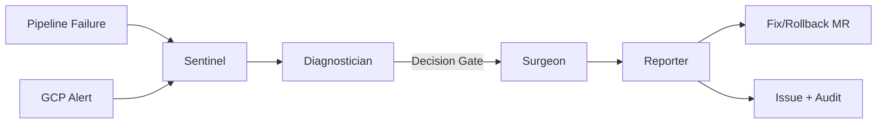

# SentryFlow Architecture

## Overview

SentryFlow is a self-healing DevOps agent flow that automatically responds to pipeline failures and production incidents. It uses four specialized AI agents orchestrated via a GitLab Duo custom flow.

## Flow Diagram



## Agent Roles

### 1. Sentinel — Event Ingestion & Routing
- **Input:** Pipeline failure webhook or GCP Cloud Monitoring alert (via Pub/Sub)
- **Output:** Unified incident schema JSON
- **Tools:** `get_job_logs`, `get_pipeline_errors`, `get_pipeline_failing_jobs`, `run_command`
- **Responsibility:** Normalize both trigger types into a single schema so downstream agents don't need to know the event source.

### 2. Diagnostician — Root Cause Analysis
- **Input:** Unified incident schema from Sentinel
- **Output:** Diagnosis JSON with failure category, confidence, and suspect commits
- **Tools:** `get_job_logs`, `get_pipeline_errors`, `list_commits`, `get_commit`, `get_commit_diff`, `get_repository_file`, `gitlab_blob_search`, `grep`, `run_command`
- **Responsibility:** Classify failures into categories (test_failure, dependency_issue, config_error, infra_timeout, permission_error). For production incidents, correlate with recent commits and GCP Cloud Logging data.

### 3. Surgeon — Fix Generation & Action
- **Input:** Diagnosis JSON from Diagnostician
- **Output:** Merge request (fix or rollback) or issue
- **Tools:** `create_file_with_contents`, `edit_file`, `create_commit`, `create_merge_request`, `create_issue`, `find_files`, `list_repository_tree`, `get_repository_file`
- **Decision routing:**
  - High confidence + code/config/dep issue → generate fix, create branch `sentryflow/fix-{description}`, open MR
  - Production incident with suspect commit → create branch `sentryflow/rollback-{sha}`, revert commit, open MR
  - Low confidence → create issue for human triage, no auto-fix

### 4. Reporter — Communication & Audit
- **Input:** Action taken by Surgeon + diagnosis from Diagnostician
- **Output:** Structured comment on MR/issue + BigQuery audit log entry
- **Tools:** `create_merge_request_note`, `create_issue_note`, `create_issue`, `run_command`
- **Responsibility:** Post a structured summary (root cause, severity, confidence, fix applied, GCP context) and log the incident to BigQuery for historical analysis.

## Unified Incident Schema

The contract between all agents. Produced by Sentinel, consumed by all downstream agents.

```json
{
  "trigger_type": "pipeline_failure | gcp_alert",
  "project_id": "<gitlab-project-id>",
  "timestamp": "<ISO-8601>",
  "severity": "P1 | P2 | P3 | P4",
  "failure_context": {
    "source": "pipeline | gcp_monitoring",
    "pipeline_id": "<id or null>",
    "job_id": "<id or null>",
    "job_name": "<name or null>",
    "stage": "<stage or null>",
    "failure_message": "<extracted error>",
    "alert_policy_name": "<name or null>",
    "metric": "<metric or null>",
    "threshold": "<value or null>",
    "resource": "<resource identifier or null>",
    "raw_payload": {}
  }
}
```

## Dual-Trigger Architecture

### Trigger A: Pipeline Failure
```
Pipeline fails → GitLab trigger event (pipeline_failed)
  → Sentinel extracts job IDs, reads logs, normalizes to schema
  → Diagnostician classifies failure category from log patterns
  → Surgeon generates code/config fix on new branch
  → Reporter posts diagnosis to MR
```

### Trigger B: Production Incident (GCP)
```
Error rate spike → Cloud Monitoring alert fires
  → Pub/Sub message → GitLab issue created (mentioning agent)
  → Sentinel parses alert payload, normalizes to schema
  → Diagnostician correlates with recent commits + Cloud Logging
  → Surgeon creates rollback MR or remediation issue
  → Reporter posts incident summary with GCP log links
```

## Decision Gate Logic

After Diagnostician produces a diagnosis, the Surgeon routes based on:

| Condition | Action |
|-----------|--------|
| confidence=high AND category IN (test_failure, dependency_issue, config_error) | Create fix MR |
| trigger_type=gcp_alert AND suspect commit identified | Create rollback MR |
| confidence=medium | Create fix MR with review warning |
| confidence=low OR no clear root cause | Create issue only |

## GCP Service Integration

| Service | Role in SentryFlow |
|---------|-------------------|
| Cloud Monitoring | Detects production incidents via alert policies |
| Cloud Pub/Sub | Routes alerts from GCP to GitLab |
| Cloud Logging | Provides infrastructure context for diagnosis |
| BigQuery | Stores audit trail of all incidents and actions |

## Tool Usage by Agent

| Tool | Sentinel | Diagnostician | Surgeon | Reporter |
|------|----------|---------------|---------|----------|
| get_job_logs | x | x | | |
| get_pipeline_errors | x | x | | |
| get_pipeline_failing_jobs | x | | | |
| list_commits | | x | | |
| get_commit | | x | | |
| get_commit_diff | | x | | |
| get_repository_file | | x | x | |
| gitlab_blob_search | | x | | |
| grep | | x | | |
| create_file_with_contents | | | x | |
| edit_file | | | x | |
| create_commit | | | x | |
| create_merge_request | | | x | |
| create_issue | | | x | x |
| find_files | | | x | |
| list_repository_tree | | | x | |
| create_merge_request_note | | | | x |
| create_issue_note | | | | x |
| run_command | x | x | | x |
